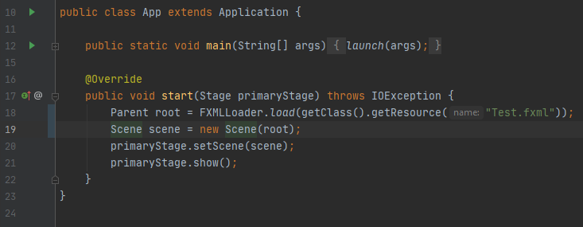

# Aplikacja JavaFX
Każdy program JavaFX musi mieć zdefiniowaną klasę aplikacji. Obiekt tej klasy jest tworzony dokładnie raz - przy starcie programu. Oto przykładowa aplikacja:



Omówmy ją szybko linijka po linijce.
```java
public class App extends Application
```
Definiuje klasę o nazwie App, która dziedziczy z klasy Application. Application jest klasą JavaFX. Klasa naszej aplikacji *musi* z niej dziedziczyć.
```java
public static void main(String[] args) {
    launch(args);
}
```
Początkiem większości aplikacji w Javie jest `public static void main(String[] args)`. Kod w środku tej funkcji jest wywoływany przy uruchomieniu programu, jest to odpowiednik `int main(int argc, char** argv)` z języka C. JavaFX jest tutaj wyjątkiem, i `public static void main(String[] args)` jest opcjonalne. Instrukcja `launch(args)` faktycznie odpala naszą aplikację okienkową.
```java
@Override public void start(Stage primaryStage) throws IOException
```
Ta funkcja jest w JavaFX wymagana. Zostanie ona wywołana, kiedy utworzone zostanie pierwsze okno aplikacji - jest nim właśnie zmienna `primaryStage`. `@Override` oznacza, że ta funkcja "zastępuje" taką samą funkcję z klasy `Application` naszym kodem. `throws IOException` wytłumaczę przy następnej linijce.
```java
Parent root = FXMLLoader.load(getClass().getResource("Test.fxml"))
```
Ta linijka mogłaby być rozbita na dwie:
```java
URL resourceUrl = getClass().getResource("Test.fxml")
```
Ta linijka znajduje nam plik o nazwie *Test.fxml* i zapisuje URL do niego w zmiennej resourceUrl.
```java
Parent root = FXMLLoader.load(resourceUrl)
```
Ta natomiast wczytuje nam interfejs użytkownika z naszego pliku *Test.fxml* i zapisuje go do zmiennej `root`. Zastanówmy się, co się stanie jak pod resourceUrl nie będzie żadnego pliku, lub plik będzie w złym formacie. Java nam w takim przypadku zwraca błąd, tzw wyjątek. W tym wypadku jest to `IOException`, czyli błąd przy czytaniu lub zapisie danych. Jeśli nie sprawdzimy od razu, czy wystąpił ten błąd, zostanie on przekazany dalej, a wykonanie naszej funkcji zostanie przerwane - nasza funkcja musi o tym Javę powiadomić, od tego jest fragment `throws IOException`. Oznacza, że w naszej funkcji może wystąpić błąd z wyjściem lub wejściem (zapisem lub odczytem danych z dysku, wysyłaniem lub pobieraniem danych z sieci, itd.) i ktokolwiek wywołuje tę funkcję, powinien sprawdzić ten błąd.
```java
Scene scene = new Scene(root)
```
Scena jest początkiem interfejsu użytkownika, i każde okno ma jedną scenę. Tutaj tworzymy scenę, i wrzucamy do niej interfejs użytkownika, który wcześniej wczytaliśmy.
```java
primaryStage.setScene(scene)
```
Powiązujemy naszą scenę z głównym oknem aplikacji. Teraz, gdy zostanie otwarte, będzie prezentować nasz interfejs.
```java
primaryStage.show()
```
Tutaj w końcu otwieramy nasze okno. Uf, nareszcie. Mam nadzieję, że nie był to nadmiar informacji. Tutaj oferuję podsumowanie:

***Podsumowanie:*** JavaFX automatycznie tworzy pierwsze okno naszej aplikacji. W JavaFX okna to `Stage`. Każde okno ma swoją scenę (`Scene`), która prezentuje interfejs użytkownika. Interfejs możemy wczytać z plików FXML za pomocą `FXMLLoader.load(urlDoPlikuFXML)`. Url możemy uzyskać poprzez `getClass().getResource("Plik.fxml")`. Aha, tytuł naszego okna możemy ustawić za pomocą `primaryStage.setTitle("Tytuł okna")`. W następnej części powiem w końcu, jak tworzyć interfejs użytkownika, i jak tworzyć nowe okna.
