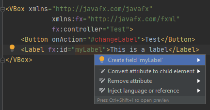

# Tworzenie interfejsu użytkownika za pomocą FXMLa
Na potrzeby tego dokumentu, wszystkie fragmenty kodu są tworzone na nowej gałęzi. Jeśli nie chcecie tworzyć nowego projektu, też polecam wam pracować na nowej gałęzi testowej (pamiętajcie, aby commitować zmiany przed zmianą gałęzi).

## Tworzenie okna
Jak już wiemy, pierwsze okno aplikacji zostanie dla nas utworzone automatycznie przez JavaFX. Nic nie stoi na przeszkodzie, abyśmy stworzyli nowe okna ręcznie. Przypomnijmy sobie, że okno w JavaFX to `Stage` - nowe okno tworzymy tak samo, jak jakikolwiek inny obiekt w Javie.
```java
Stage win = new Stage()
```
Teraz do okna możemy odnieść się za pomocą zmiennej `win`. Okno nie pokazuje się automatycznie - żeby się pokazało, wywołujemy instrukcję `win.show()`. Takie okno jest niestety ciągle bardzo puste. W poprzednim dokumencie mówiliśmy, że każde okno ma swoją scenę, która gości interfejs użytkownika. Stwórzmy więc taką scenę.
```java
VBox root = new VBox();
Scene scene = new Scene(root);
Stage win = new Stage();
win.setScene(scene);
win.show();
```
Utworzyliśmy teraz scenę, której rootem (korzeniem) jest VBox. Root sceny to jest po prostu element początkowy interfejsu użytkownika, musi nim być jakiś layout. Layouty to takie elementy, które same nie mają wizualnego komponentu, ale układają swoje dzieci w jakiś konkretny sposób. Wszystko, co wrzucimy do VBoxa, będzie układane pionowo. Gdybyśmy użyli HBoxa, to by było układane poziomo. Jest w JavaFX mnóstwo różnych layoutów. Dodajmy teraz jakieś dzieci do naszego VBoxa, aby w końcu pokazać coś konkretnego.
```java
Button button = new Button("Click me! I'm a button!");
VBox root = new VBox();
root.getChildren().addAll(button);
Scene scene = new Scene(root);
Stage win = new Stage();
win.setScene(scene);
win.show();
```
Sprawa jest dość prosta. `root.getChildren()` to lista dzieci naszego VBoxa. `add(button)` dodaje do niej nasz przycisk. To wszystko, co jest wymagane, aby utworzyć nowe okno z jakimś interfejsem użytkownika.

## FXML
Takie rozwiązanie jest bardzo nieefektywne. Miesza kod z layoutem, oraz wymaga tworzenia layoutu w bardzo nienaturalny sposób, okropny w pisaniu i czytaniu. Do layoutów dużo bardziej pasuje drzewiasta struktura, i tutaj powstał oparty na XMLu FXML. FXML pozwala nam tworzyć layout w sposób deklaratywny, dużo bardziej naturalny. Odpowiednikiem poprzedniego kodu z przyciskiem jest w FXML (w skrócie):
```XML
<VBox>
  <Button>Click me! I'm a button!</Button>
</VBox>
```
Już teraz możemy zauważyć znaczną poprawę. Teraz nasze elementy widzimy w środku ich rodziców, tam gdzie logicznie powinny być, i tam gdzie będziemy je widzieć w okienku. Rozwińmy trochę ten przykład.
```XML
<BorderPane>
  <left>
    <VBox>
      <Button>Home</Button>
      <Button>Settings</Button>
      <Button>Help</Button>
    </VBox>
  </left>
  <center>
    <VBox>
      <HBox>
        <Label>Name</Label>
        <TextField />
      </HBox>
      <HBox>
        <Label>Password</Label>
        <PasswordField />
      </HBox>
    </VBox>
  </center>
</BorderPane>
```
BorderPane to layout, który dzieci układa w 5 segmentach - na lewo, na prawo, na górę, na dół, oraz w środku. Tutaj mamy pionową listę z przyciskami po lewej stronie interfejsu, a w środku interfejsu mamy pionowy układ par inputów i ich opisek (które same leżą obok siebie). Przykład ten ma na celu zademonstrować możliwości zagnieżdżania FXMLa. Jego zwięzłość jest możliwa tylko dzięki deklaratywnemu stylowi. Ten sam kod w Javie byłby tak żmudny do napisania, że napisanie go pozostawiam jako ćwiczenie dla czytelnika. 

Jak podłączyć plik FXML pod nasz kod? Używając `FXMLLoader.load()`, o którym wcześniej mówiliśmy. Czyli jeśli nasz plik to *Layout.fxml*, to podpięcie go będzie wyglądało następująco:
```java
Parent root = FXMLLoader.load(getClass().getResource("Layout.fxml"));
Scene scene = new Scene(root);
Stage win = new Stage();
win.setScene(scene);
win.show();
```

Aby utworzyć nowy plik FXML, w IntelliJ klikamy prawym przyciskiem na *Resources* i wybieramy *New -> FXML File*


W wyskakującym okienku nadajemy nazwę naszemu plikowi i klikamy *OK*. 


Plik zostanie utworzony. IntelliJ odrazu zaznaczy nazwę kontrolera do edycji. Możemy zatwierdzić domyślną nazwę klikając enter, lub wpisać wybraną nazwę i zatwierdzić klikając enter. Kontroler jest czymś, co obsługuje nasze ruchy myszką, kliknięcia w przycisk, czy też wpisywanie tekstu klawiaturą. Innymi słowy, kontroler obsługuje *wydarzenia* (eventy), które dzieją się w naszym interfejsie.


Nazwa naszego kontrolera jest czerwona. Oznacza to, że on nie istnieje. Aby to naprawić, przesuwamy kursor (klawiaturą lub myszką) na nazwę kontrolera, i klikamy *ALT + ENTER* lub klikamy myszką na żarówkę. Wybieramy *Create Class*.


W oknie wyboru, gdzie utworzyć tę klasę, wybieramy *src/main/java*.


Zamieńmy domyślny AnchorPane na VBoxa, i dodajmy do niego przycisk i pole tekstowe. Powinno to teraz wyglądać tak:


Wszystko jest na razie fajnie, ale nasz przycisk nic nie robi. Naprawmy to. Mówiliśmy wcześniej o tym, że kontroler obsługuje wydarzenia, które dzieją się w naszym interfejsie użytkownika. Niech więc obsłuży wydarzenie aktywacji przycisku. Żeby zmienić właściwości jakiegoś elementu w XML, na przykład `<Button>Im a button</Button>` używamy takiej składni: `<Button attribute=value>Im a button</Button>` gdzie attribute to właściwość, a value to jego wartość. W tym wypadku nasz atrybut to `onAction`, czyli co się dzieje po aktywacji przycisku, a wartość to nazwa funkcji, która ma być wywołana po aktywacji przycisku. Nasz przycisk będzie więc wyglądał tak: 


Teraz po aktywacji przycisku zostanie wywołana funkcja `changeLabel`. # przed nazwą funkcji jest wymagany. Na razie jest ona czerwona, czyli jeszcze nie istnieje. Ustawmy na niej kursor i kliknijmy `ALT + ENTER` lub kliknijmy na żarówkę. Wybierzmy *Create method*


Zostanie utworzona nasza funkcja. Kod, który wpiszemy w jej środku, zostanie wykonany *za każdym razem*, gdy aktywujemy przycisk. Jeśli w środku niej wpiszemy `System.out.println("Dzień dobry panie ministrze!");`, to za każdym razem po kliknięciu przycisku wypiszemy do konsoli *Dzień dobry panie ministrze!*. Spróbujmy zmienić tekst naszego Labelka po kliknięciu przycisku. Żeby móc to zrobić, musimy najpierw miec możliwość odniesienia się do naszego Labelka. Żeby dodać obsługę onAction dla przycisku, robiliśmy `onAction="#nazwaFunkcji"`. Żeby dodać id do naszego Labelka posłużymy się więc `fx:id="naszeId"`. Po dodaniu tego atrybutu, będzie on podświetlony dziwnym żółtym kolorem. Oznacza to, że na razie nie ma go w kodzie.


Naprawiamy to tak samo jak nasze `onAction` czy nasz controller. *ALT + ENTER* i wybieramy *Create field*. 



Teraz w kontrolerze możemy odnieść się do naszego Labelka za pomocą zmiennej nazwanej po id. Do zmiany tekstu używamy funkcji `setText()`. Voila.


