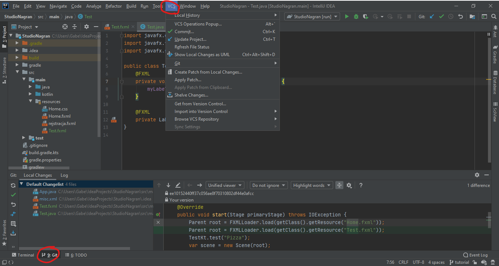

# Git
Git jest systemem kontroli wersji (*VCS* - Version Control System). Służy on do koordynowania pracy wielu programistów nad jednym projektem. Istnieje wiele platform hostujących gita, między innymi *GitHub* i *GitLab*, ale także Bitbucket. W IntelliJ większość operacji związanych z gitem wykonujemy w menu *VCS* lub w zakładce *Git* w lewym dolnym rogu.

## Add
Git nie śledzi nowo utworzonych plików. Musimy je jawnie dodać do gita poprzez komendę *git add*. W IntelliJ, po dodaniu pliku po prostu zostaniemy zapytani, czy dodać ten plik do gita.

## Commit
W gicie wszelkie zmiany wykonywane na plikach, dodawanie nowych plików, i usuwanie plików muszą być zatwierdzone. Służy do tego komenda *git commit*. W IntelliJ wybieramy *VCS -> Commit*, w wyskakującym okienku wybieramy, które zmiany chcemy zatwierdzić, oraz dodajemy **krótką i deskryptywną** wiadomość. 

## Push
Komenda *git push* wysyła wszystkie dotychczasowe commity w danej gałęzi na serwer zdalny (GitHub, GitLab, etc.). IntelliJ pozwala nam pushować przy okazji commita, rozwijając przycisk commit i wybierając commit & push. Możemy także ręcznie pushować poprzez *VCS -> Git -> Push*

## Pull
Żeby pobrać zmiany, które ktoś inny *push*nął, korzystamy z komendy *git pull* (dostępnej w *VCS -> Git -> Pull*). 

## **Branch (ważne)**
Gałęzie są bardzo ważną cechą gita, i cechą która faktycznie definiuje go wśród innych alternatyw VCS. Git faworyzuje częste rozgałęzianie projektu, oferując implementację, która bardzo szybko tworzy i scala gałęzie. Gałęzie pozwalają na zatrzymanie się na jakimś etapie projektu (rozgałęzianie się, branching out). Wszystkie commity, które robimy na gałęzi, nie dotkną gałęzi głównej (master). Gałęzie są potem granularnie *scalane* (merge) do mastera, żeby aplikować zmiany w kontrolowany sposób (kiedy wiemy, że nie ma konfliktów między dwoma różnymi gałęziami, które scalamy do mastera, oraz kod w gałęziach jest sprawdzony pod względem jakości).
Rozgałęzianie się przedstawia ten flowchart:

***Uwaga:*** bezpośrednio na masterze nie powinniśmy pracować prawie nigdy. Jako rule of thumb, dla każdej nowej zawartości jaką dodajemy, lub buga który naprawiamy, tworzymy nowy branch, którego nazwa jakoś odnosi się do tego, co robimy. Możemy do niego commitować i pushować do woli, a gdy uważamy, że skończyliśmy już nad tym pracę, wysyłamy *pull requesta*. (Formalnie, w tak małym zespole i na potrzeby akademickie, wystarczy zawiadomić osobę w teamie, która zajmuje się reviewem, że się skończyło, żeby przejrzała kod i sprawdziła, czy nie ma merge conflictów). Obecny branch możemy zobaczyć w prawym dolnym rogu w IntelliJ.

Po kliknięciu na obecny branch, otwiera się okienko, w którym możemy się przełączać między gałęziami (*git checkout*) i tworzyć nowe. Jeśli nie możemy utworzyć nowego brancha, najprawdopodobniej musimy najpierw *pull*nąć zmiany z remote'a.

Po wybraniu *New Branch*, powita nas takie okienko. Nadajemy imię branchowi, zaznaczamy *checkout branch*, żeby po stworzeniu przełączyć się na brancha, i klikamy *Create*. Możemy teraz spokojnie pracować nad projektem.

