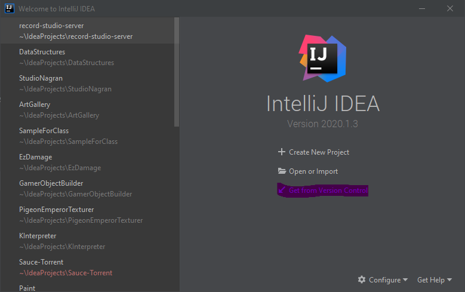
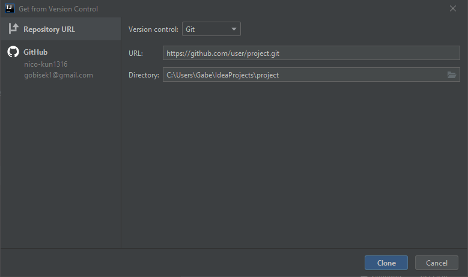
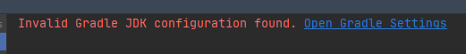
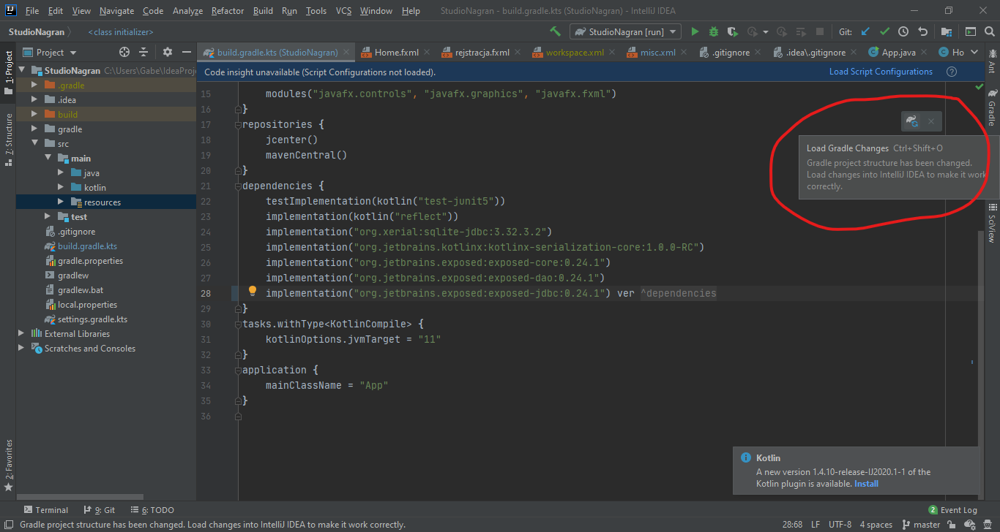
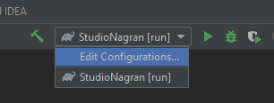
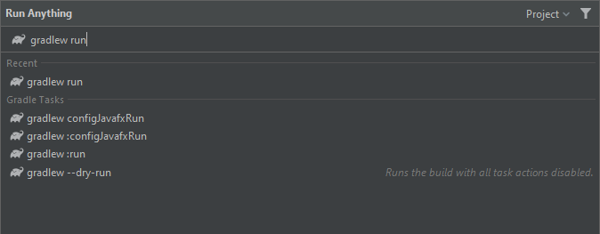

# Importowanie projektu
Importowanie projektu JavaFX w Intellij Idea jest bardzo proste.
Należy uruchomić ekran startowy IDE. Jeśli po uruchomieniu wyświetla się ostatnio otwarty projekt, zamykamy go File -> Close Project. Klikamy **Get from Version Control**.

Otworzy nam się takie okienko. Wybieramy opcję *git*. W polu *url* wpisujemy link do naszego repo. Pole *directory* określa folder, w którym zostanie utworzona kopia projektu na dysku. Klikamy **clone**.

Możemy dostać taki komunikat. Klikamy wtedy na niebieski tekst i z czerwonego dropdowna wybieramy **JDK 11**. Jeśli nie mamy JDK, Intellij pozwala tu je pobrać.

Za każdym razem, gdy są zmiany w build scriptcie, Idea musi je przetworzyć, aby oferować autouzupełnianie i inne pomoce. Pokazuje się wtedy takie okienko w prawym górnym rogu. Klikamy na **Load Gradle Changes**.

Jeśli wszystko jest OK, powinniśmy teraz móc skompilować i otworzyć projekt. Uruchamiamy projekt przez wybranie odpowiedniej konfiguracji w prawym górnym rogu i kliknięcie zielonego przycisku.

Jeśli nie mamy konfiguracji, należy kliknąć szybko dwa razy klawisz *CTRL* i wpisać **gradlew run**, zatwierdzić klawiszem *ENTER*.

Z menu konfiguracji możemy teraz zapisać tę konfigurację na przyszłość.
